# Focus — The Developer's Pomodoro & Task Manager

A minimal, highly customizable Pomodoro timer and task manager built to improve my productivity. I wanted a split-screen tool that keeps my immediate tasks front-and-center while giving me absolute control over my timer's UI and workflow. 

**[🔗 Live Preview](https://stefan0712.github.io/focus/)**

<p align="center">
  
  
  
  
  
  
</p>

---

## 🎯 Why I Built This
There are hundreds of Pomodoro apps out there, but most are either too cluttered or entirely lack a built-in task manager. I built **Focus** to have a unified dashboard where I can track my exact work sessions, manage prioritized tasks, and strip away the UI entirely when I need deep work.

---

## ✨ Core Features

### ✅ Integrated Task Management & Timer
* **Split-Screen UI:** Tasks live right next to the timer. You can instantly swap the layout panels to fit your preference or stack them naturally on mobile.
* **Triaging:** Add tasks with distinct priority levels, pin important tasks to the top, and mark them as complete to automatically push them out of the way.
* **Session Tracking:** A live counter tracks your current cycle (Focus / Short Break / Long Break), keeping you aware of how many blocks you've completed without needing to check a separate log.

### 🎨 Distraction-Free UI (Zen Mode)
* **Deep Focus Mode:** Hide all buttons, task panels, and controls. The UI fades away—accessible only via a minimal edge arrow—leaving just the bare essential countdown on your screen.
* **Maximized States:** Expand the timer to take up the full browser window for absolute, tunnel-vision focus.
* **Adaptive Visuals:** Features a clean, rounded-square progress loop indicator that subtly shows time elapsed without being a distraction.

### ⚙️ Total Customization
* **Custom Intervals:** Fully tweak the duration of Focus sessions, Short Breaks, and Long Breaks, as well as how frequently those long breaks occur.
* **Always On:** Built-in toggles for Fullscreen mode and a "Keep Screen Awake" lock using the browser's native Wake Lock API so your device never goes to sleep mid-session.
* **Theme Control:** Multiple pre-built themes, including a true AMOLED dark mode, to perfectly match your developer setup.

---
## 📸 App Gallery

### The Dashboard
The core workspace. Manage tasks, pin priorities, and track your Pomodoro intervals side-by-side. Seamlessly adapts from wide desktop views to vertical mobile layouts.

<p align="center">
  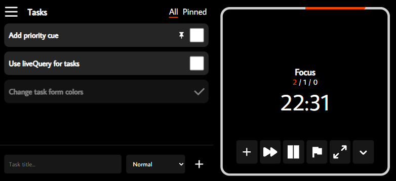
  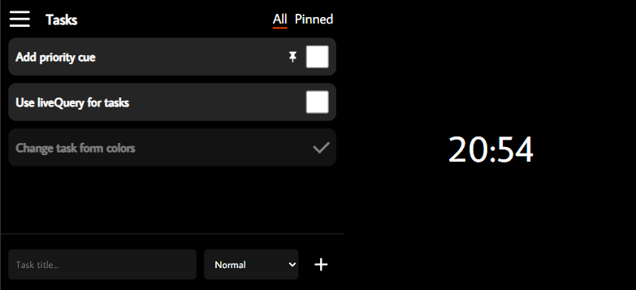
</p>

### Deep Focus & Settings
Eliminate distractions completely with Maximized and Zen modes, or dive into the settings to customize your flow.

<p align="center">
  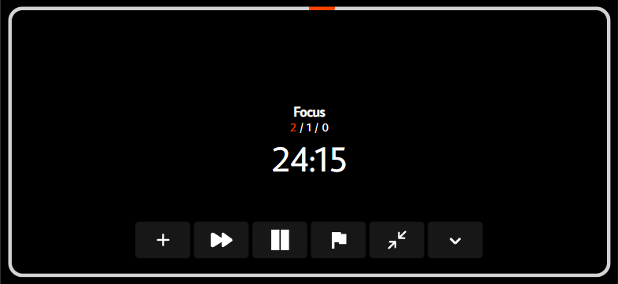
  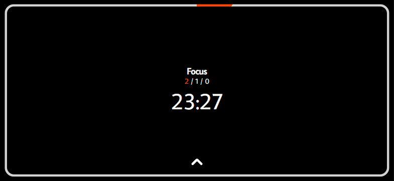
</p>

<p align="center">
  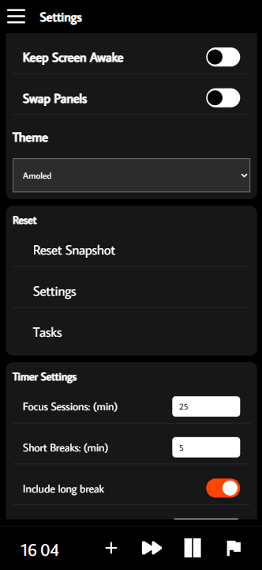
  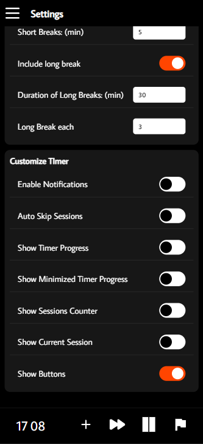
  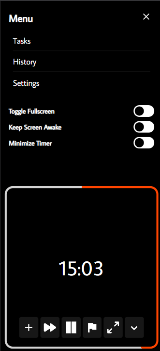
</p>
<p align="center">
  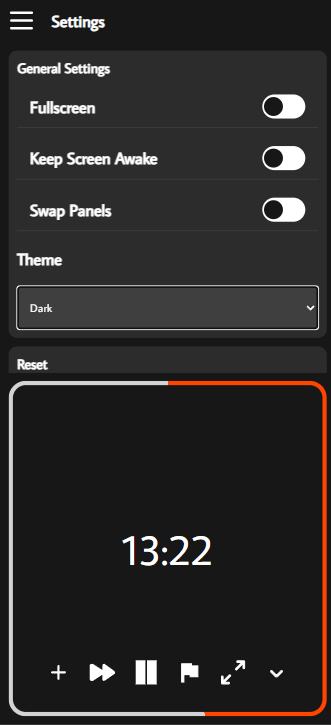
  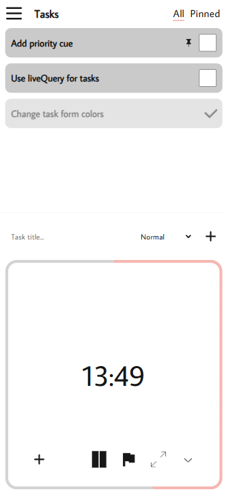
  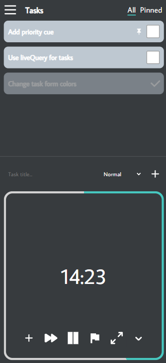
  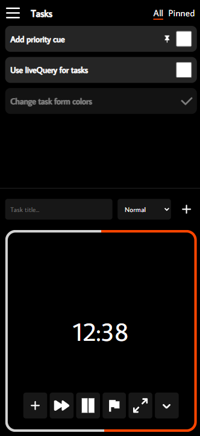
</p>

## 🏗️ How It Works Under the Hood

Because this tool is meant to be reliable and snappy, I focused heavily on offline capabilities and strict state management.

### 1. Local-First Data with Dexie.js
Task management and session history are completely offline. I used `Dexie.js` as a wrapper for IndexedDB. By creating specific database indexes, the app uses `useLiveQuery` to instantly re-sort the task list the millisecond you click a button—pushing completed tasks to the bottom and pinned tasks to the top without any loading states.

### 2. Complex UI State with Redux Toolkit
With features like swapping panels, maximizing the timer, hiding UI controls, and saving "snapshots" of the timer state, passing props down the tree wasn't going to cut it. I used **Redux Toolkit** to manage the global application settings and UI states cleanly. 

### 3. Progressive Web App (PWA)
Focus is a fully configured PWA using `vite-plugin-pwa`. It can be installed directly to your phone or desktop home screen. Once installed, it runs as a standalone native app without browser URL bars taking up valuable screen space.

---

## 💻 Running Locally

### Setup
1. **Clone the repository:**
   ```bash
   git clone https://github.com/stefan0712/focus.git
   ```

2. **Navigate to the project directory:**
   ```bash
   cd focus
   ```

3. **Install dependencies:**
   ```bash
   npm install
   ```

4. **Start the development server:**
   ```bash
   npm start
   ```
   *Open `http://localhost:5173` in your browser.*

---

## 👤 Author & License

**Stefan Vladulescu**
* **Portfolio:** [stefanvladulescu.com](https://stefanvladulescu.com)
* **GitHub:** [@stefan0712](https://github.com/stefan0712)

Distributed under the **MIT License**.